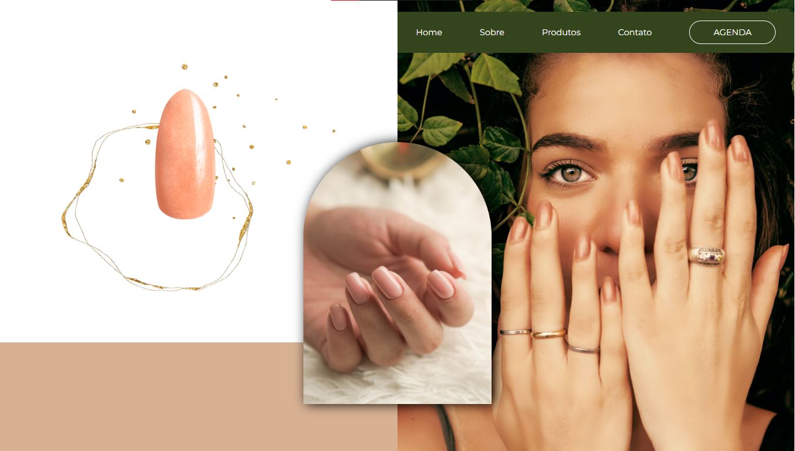

# Projeto Programação web 

Trabalho em grupo para avaliação do semestre

Componentes do Grupo

<table>
  <tr>
    <td align="center">
      <a href="https://github.com/Morinian">
         
        
          <b>Paula Martins</b>
        
      </a>
    </td>
    <td align="center">
      <a href="https://github.com/">
         
        
          <b>Nycolly Vitória</b>
        
      </a>
    </td>
    <td align="center">
      <a href="https://github.com/">
         
        
          <b>Matheus Oliveira</b>
        
      </a>
    </td>
    <td align="center">
      <a href="https://github.com/">
         
        
          <b>Vitor Gabriel</b>
        
      </a>
    </td>
  </tr>
  <tr>
  </tr>
</table>
